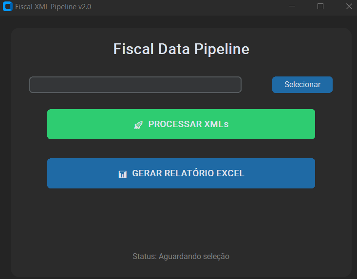

# Fiscal XML Data Pipeline: Automated ETL & Reporting



## 📌 Project Overview
This project is a high-performance **Data Pipeline** developed in Python to automate the ingestion and processing of Brazilian Electronic Tax Documents (**NF-e** and **CT-e**). 

The system implements a complete **ETL (Extract, Transform, Load)** workflow: it parses complex XML files (including nested namespaces and ZIP archives), stores the structured data in a local **SQLite** database, and generates analytical reports in **Excel**. 

While tailored to Brazilian standards, the modular architecture is designed for **Scalability**, making it easily adaptable to European e-invoicing standards such as **ZUGFeRD** or **XRechnung**.

## 🛠 Tech Stack
* **Language:** Python 3.10+
* **Data Processing:** Pandas (High-performance data manipulation)
* **Storage:** SQLite3 (Serverless relational database)
* **Interface:** Tkinter (Desktop GUI for end-users)
* **Reporting:** OpenPyXL (Excel integration)
* **DevOps/Org:** Modular 'src/' architecture & Logging system

## 🔍 Key Technical Features
* **Robust XML Parsing:** Advanced use of `xml.etree.ElementTree` with full support for XML Namespaces, ensuring accurate data extraction from SEFAZ-compliant files.
* **Automated ZIP Ingestion:** Integrated logic to automatically detect, unzip, and process compressed batches of XML files.
* **Data Integrity:** SQL implementation of `INSERT OR IGNORE` logic and primary key constraints to prevent data duplication and ensure audit-ready datasets.
* **Professional Logging:** System-wide monitoring using `logging` library, tracking successes and failures in a `system_log.log` file for easy maintenance.
* **User-Centric Design:** A clean Graphical User Interface (GUI) that allows non-technical financial analysts to trigger complex data pipelines with one click.

## 📁 Project Structure
```text
xml-data-pipeline-py/
├── data/                # Database storage and system logs
├── src/                 # Source code (Modular Logic)
│   ├── main.py          # Application entry point
│   ├── main_interface.py # GUI implementation (Tkinter)
│   ├── main_events.py    # ETL Orchestrator
│   ├── xml_parser.py     # XML extraction logic
│   └── database_manager.py # SQLite schema and operations
├── requirements.txt     # Project dependencies
└── README.md            # Documentation


🚀 How to Run
Clone the repository:

Bash
git clone [https://github.com/your-username/xml-data-pipeline-py.git](https://github.com/your-username/xml-data-pipeline-py.git)
cd xml-data-pipeline-py
Install dependencies:

Bash
pip install -r requirements.txt
Launch the app:

Bash
python src/main.py
💼 Business Impact
Operational Efficiency: Eliminated manual data entry, reducing the time spent on monthly fiscal reconciliations by approximately 90%.

Compliance & Audit: Guaranteed 100% data consistency by centralizing scattered XML files into a structured SQL environment.

Data Democratization: Enabled the tax department to generate self-service reports without relying on IT or ERP (SAP) support for simple data lookups.

Author: Abimael Brilhante Soares Rodrigues

Data Analyst | Specialist in SAP Financial Data, Snowflake & Python Automation
